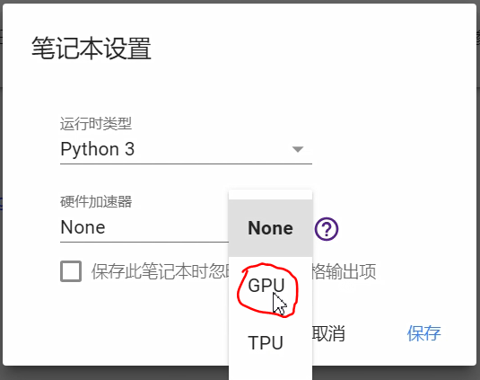

# Win10 下的安装tensorflow,Pytorch

## 1.下载NVIDIA驱动（下载CUDA会更新驱动，这步可以跳过）

[NVIDIA® GPU drivers](https://www.nvidia.com/drivers):CUDA 9.0 requires 384.x or higher.

NVIDIA图形驱动版本可以在控制面板中的程序和功能中查看。如果版本合适就不用下载最新的驱动了。

## 2.下载CUDA 9.0

[CUDA® Toolkit](https://developer.nvidia.com/cuda-zone) —TensorFlow supports CUDA 9.0.不需要下载补丁。


安装好后，输入

```text
nvcc -V
```

进行测试，如果显示如下，证明你安装成功了。


## 3.下载CNDNN 7

- [cuDNN SDK](https://developer.nvidia.com/cudnn) (>= 7.2)

简单来说，把下载好的zip文件解压，然后把里面的文件拷贝到cuda安装位置的目录下面。

Copy the following files into the CUDA Toolkit directory.

1. Copy <installpath>\cuda\bin\cudnn64_7.dll to C:\Program Files\NVIDIA GPU Computing Toolkit\CUDA\v9.0\bin.
2. Copy <installpath>\cuda\ include\cudnn.h to C:\Program Files\NVIDIA GPU Computing Toolkit\CUDA\v9.0\include.
3. Copy <installpath>\cuda\lib\x64\cudnn.lib to C:\Program Files\NVIDIA GPU Computing Toolkit\CUDA\v9.0\lib\x64.


## 4.添加环境变量

例如，如果安装了CUDA Toolkit `C:\Program Files\NVIDIA GPU Computing Toolkit\CUDA\v9.0`，则更新`%PATH%`的匹配：

```
SET PATH=C:\Program Files\NVIDIA GPU Computing Toolkit\CUDA\v9.0\bin;%PATH%
SET PATH=C:\Program Files\NVIDIA GPU Computing Toolkit\CUDA\v9.0\extras\CUPTI\libx64;%PATH%
```

## 5.安装python3或者anaconda

python3安装包[下载](https://www.python.org/downloads/)

anaconda安装包[下载](https://www.anaconda.com/download/)

## 6.tensorflow

### 6.1安装GPU版本tensorflow

```bash
# GPU package for CUDA-enabled GPU cards
pip install tensorflow-gpu
```

如果想要检测tensorflow的确可以用gpu来做运算了，请用以下程序测试

```text
# Creates a graph.
a = tf.constant([1.0, 2.0, 3.0, 4.0, 5.0, 6.0], shape=[2, 3], name='a')
b = tf.constant([1.0, 2.0, 3.0, 4.0, 5.0, 6.0], shape=[3, 2], name='b')
c = tf.matmul(a, b)
# Creates a session with log_device_placement set to True.
sess = tf.Session(config=tf.ConfigProto(log_device_placement=True))
# Runs the op.
print(sess.run(c))
```

测试结果如下图


图中

```text
device:GPU:0
```

的意思就是说该运算用到了GPU。

### 6.2 GPU加速效果

详见[colab文件](https://colab.research.google.com/gist/xiao-keeplearning/7afb24fcb6bd273f42aae2b4f23d8675)

### 6.3 tensorflow入门教程（作为官方文档的补充）

1. Stanford的CS 20SI课程，[参考代码](https://github.com/chiphuyen/stanford-tensorflow-tutorials)
2. https://github.com/aymericdamien/TensorFlow-Examples

## 7.pytorch

### 7.1 安装Pytorch

按照官网要求[下载](https://pytorch.org/get-started/locally/)


验证是否能用GPU:

```python
import torch
# the number of GPUs available
if torch.cuda.is_available():
    print("Found NVIDIA GPU."
        "Number:",torch.cuda.device_count(), '\n'
        "Type:",torch.cuda.get_device_name(0))
else:
  print("No found.")
```

### 7.2 GPU加速效果

详见[colab文件](https://colab.research.google.com/gist/xiao-keeplearning/7afb24fcb6bd273f42aae2b4f23d8675)

### 7.3 Pytorch入门教程（官方文档补充）

1. https://github.com/yunjey/pytorch-tutorial
2. 中文的https://github.com/chenyuntc/pytorch-book

## 8. colab的使用

[官方入门](https://colab.research.google.com/notebooks/welcome.ipynb)

注意：跑程序前先确认笔记本设置为python3,硬件加速器为GPU。




