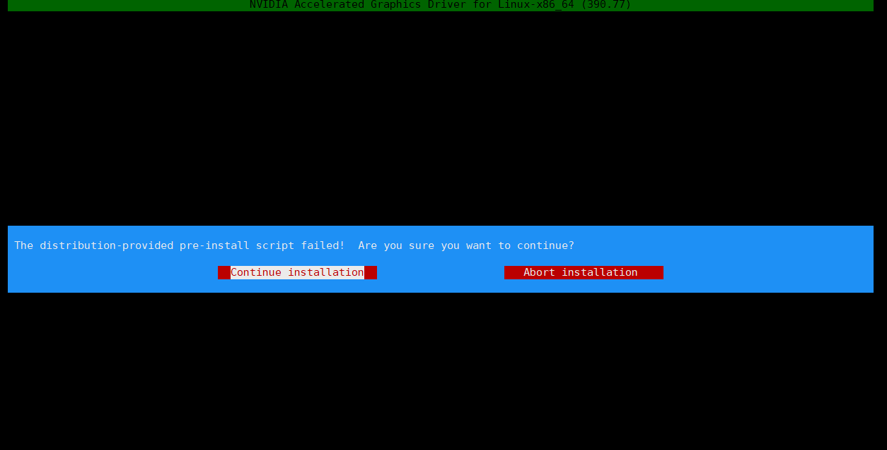
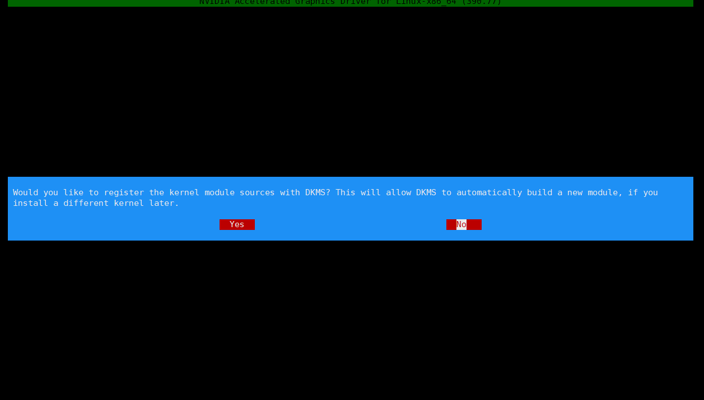
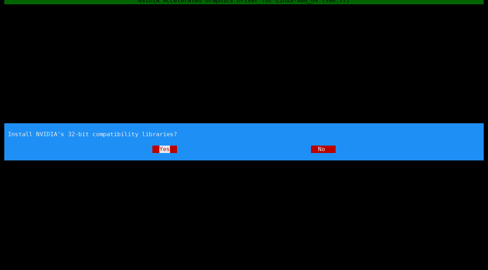
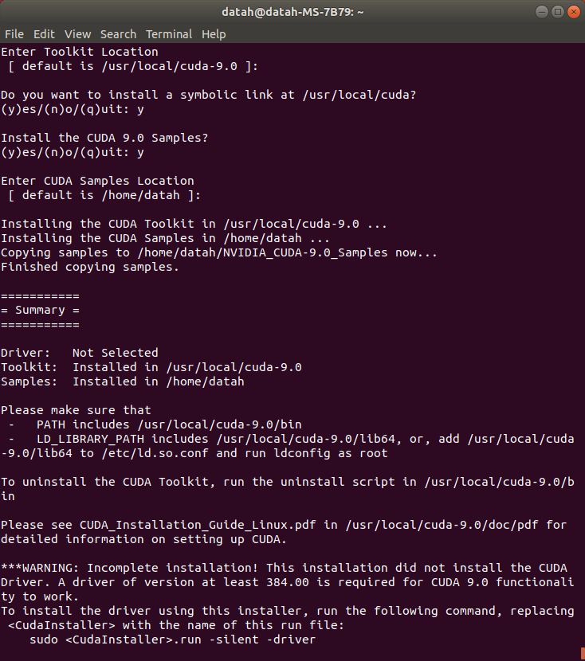

# Linux环境下英伟达驱动的安装

### 1、删除旧的驱动

```
sudo apt-get purge nvidia*
```

### 2、禁止自带的nouveau nvidia驱动

```
sudo vim /etc/modprobe.d/blacklist-nouveau.conf
```

填写禁止配置的内容

```
blacklist nouveau
options nouveau modeset=0
```

更新配置文件

```
sudo update-initramfs -u
```

### 3、关闭图形界面

```
sudo service lightdm stop
```

### 4、给驱动程序赋予执行权限

```shell
sudo chmod a+x NVIDIA-Linux-x86_64-390.77.run
```

### 5、安装(注意参数)

```
sudo ./NVIDIA-Linux-x86_64-390.77.run -no-opengl-files
```

在安装的时候会依次出现以下内容：

#### 5.1、选择Continue installation



#### 5.2、选择No



#### 5.3选择No



### 6、安装cuda9.0


这个cuda文件我们已经下好了可以 提供

#### 6.1、安装依赖

```
sudo apt-get install freeglut3-dev build-essential libx11-dev libxmu-dev libxi-dev libgl1-mesa-glx libglu1-mesa libglu1-mesa-dev
```

#### 6.2、安装cuda

```
sudo sh cuda_9.0.176_384.81_linux.run
```

注意：在安装过程中会提示是否需要安装显卡驱动，如图所示，在这里要选择n，其他的选择y或者回车键进行安装。 


到最终的结果如果没有错误，得到的结果如图所示： 



### 6.3、环境配置

完成以上的步骤以后一定要进行环境的配置。按步骤输入一下命令： 

```
sudo gedit ~/.bashrc
```

会弹出一个可写的配置文件，在末尾把以下配置写入并保存。 

```
export PATH=/usr/local/cuda-9.0/bin${PATH:+:${PATH}}  
export LD_LIBRARY_PATH=/usr/local/cuda-9.0/lib64${LD_LIBRARY_PATH:+:${LD_LIBRARY_PATH}}
```

最后执行

```
source ~/.bashrc
```

### 7、cudnn安装

cudnn我们也会提供安装包。

#### 7.1、解压

```
tar zxvf cudnn-8.0-linux-x64-v5.1.tgz
```

#### 7.2、拷贝

cudnn解压完里面有两个目录，分别是include/和lib64/，那我们将这两个目录下的文件拷贝到cuda的安装目录下的include和lib64

```
sudo cp -P include/cudnn.h /usr/local/cuda-9.0/include
sudo cp -P lib64/libcudnn* /usr/local/cuda-9.0/lib64
sudo chmod a+r /usr/local/cuda-9.0/lib64/libcudnn*
```