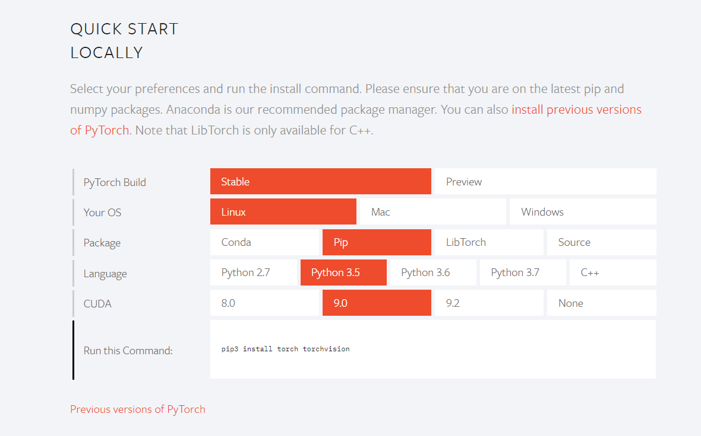

# TensorFlow和PyTorch的安装

### 1、安装pip

一般的ubuntu使用的pip是python2.7的pip，那我们现在需要的是python3的pip，所以我们要安装一个pip3

```
sudo apt-get install python3-pip
```

### 2、配置pip源

我们这里配置豆瓣镜像软件源就可以，这样可以提高pip下载的速度

在home目录下创建.pip文件夹，然后再该目录下创建pip.conf文件

```
mkdir ~/.pip
vim ~/.pip/pip.conf
```

我们再pip.conf文件编写如下内容：

```
[global]
index-url=https://pypi.doubanio.com/simple/
[install]
trusted-host=pypi.doubanio.com
disable-pip-version-check=true
timeout=6000
```

### 3、安装ipython

```
pip3 install ipython
```

### 4、安装TensorFlow

安装cpu版本的tensorflow,后面的版本号根据自己的需求自行安装，目前最新版本的tensorflow是1.11.0，如果我们没有加参数，则会安装最新版本的

```
pip3 install tensorflow==1.9.0
```

安装gpu版本的tensorflow

```
pip3 install tensorflow_gpu==1.9.0
```

### 5、打开ipython测试

```python
In [1]: import tensorflow as tf
```

```python
In [2]: a = tf.constant(0)
```

```python
In [3]: with tf.Session() as sess:
			sess.run(a)
```

出现以下内容则说明安装成功


### 6、安装pytorch

网址：https://pytorch.org/



