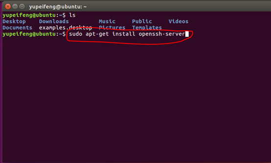
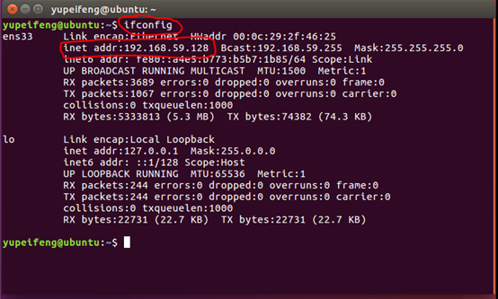
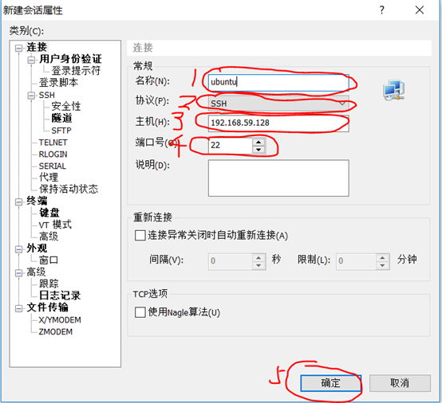
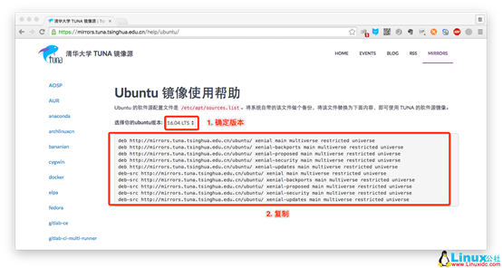
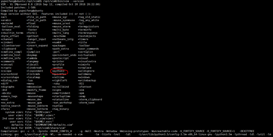
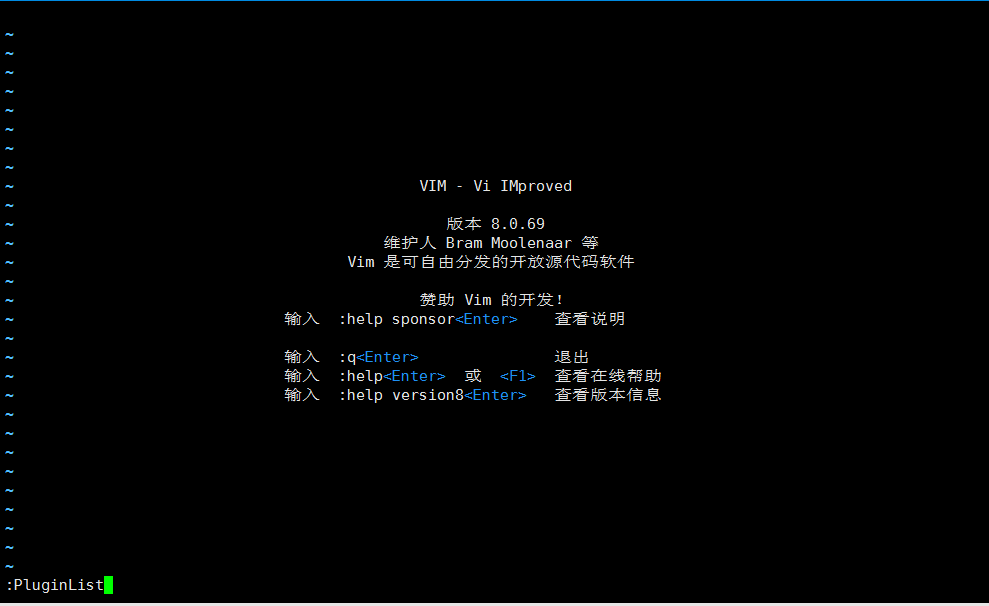
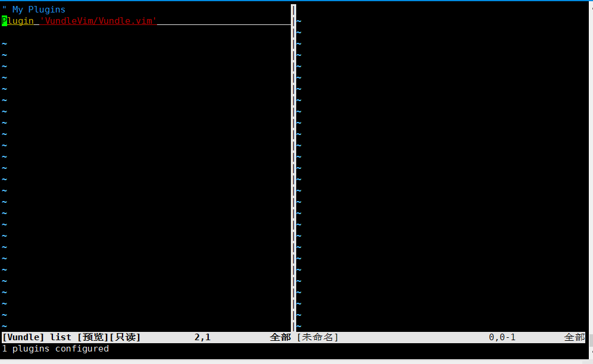
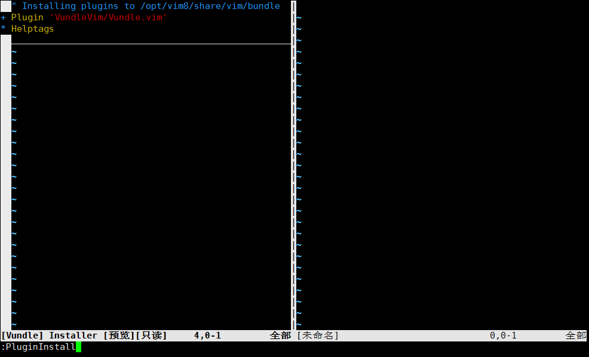
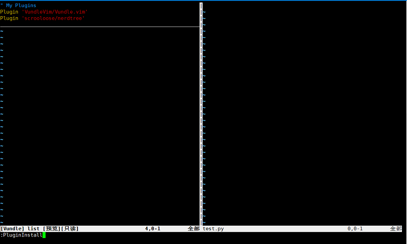
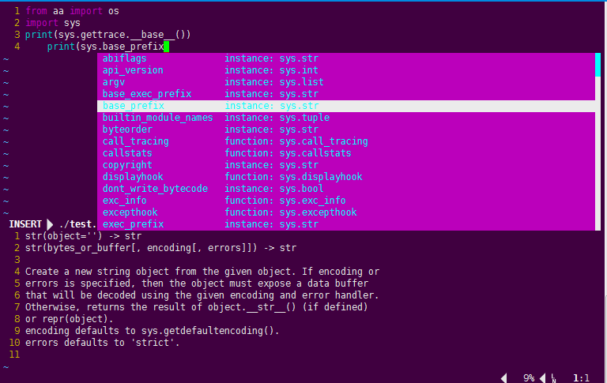

# 搭建定制化的IDE

### 1、安装openssh-server

```shell
sudo apt-get install openssh-server
```



### 2、获取相应的ip地址

```shell
ifconfig
```



### 3、使用ssh连接自己的linux系统

这里我们使用的是xshell软件，大家自行安装并学习使用



### 4、输入自己相应的账号密码

界面要输入自己linux的账号和密码，大家自行输入

### 5、配置清华镜像源，主要提高apt-get的速度

#### 5.1、寻找国内镜像源

清华镜像源网址：https://mirrors.tuna.tsinghua.edu.cn/help/ubuntu/ 



#### 5.2配置source list源

sources.list系统自带的，源是来Ubuntu的官网！安装包比较慢，所以最好切换成国内的 

```shell
cd /etc/apt
sudo cp sources.list sources.list.bak
sudo vi sources.list
```

将原本的内容全部删除，将清华镜像源的东西拷贝进去。

#### 5.3更新源

```shell
sudo apt-get update
```

### 6、下载vim8.0的安装包到自己的linux上

自己从网上下载：

```shell
wget ftp://ftp.vim.org/pub/vim/unix/vim-8.0.tar.bz2
```

如果下载的网速比较慢，可以用我们提供的安装包，自己自行用FileZilla传输到linux上面，FileZilla的学习自行解决。

### 7、关于vim8.0的一些辅助文件安装

```shell
sudo apt-get install git
sudo apt-get install python3-dev
sudo apt-get install ncurses-dev
sudo apt-get install cmake
```

### 8、git clone的速度很慢怎么办？（大家有快的方法可以推荐）

#### 8.1、打开host文件

```
sudo vi /etc/hosts
```

#### 8.2、输入G跳到最后一行，再输入o进行编辑模式

#### 8.3、再hosts文件中添加两个域名

```
192.30.253.112 github.com 
151.101.44.249 github.global.ssl.fastly.net
```

#### 8.4、esc退出编辑模式，输入：wq，保存hosts文件，修改hosts结束

#### 8.5、更新DNS缓存

```
sudo /etc/init.d/networking restart
```

### 9、解压vim8.0压缩包

```
tar -jxf vim-8.0.tar.bz2
cd vim80
```

### 10、编译安装并支持python3

```
make clean
./configure --prefix=/opt/vim8 --enable-fail-if-missing --enable-python3interp --enable-multibyte --enable-fontset --with-features=huge
sudo make
sudo make install
```

### 11、查看安装的vim信息

```
/opt/vim8/bin/vim --version
```



### 12、设置vim8的配置文件

```
sudo cp /opt/vim8/share/vim/vim80/vimrc_example.vim /opt/vim8/share/vim/vimrc
```

### 13、将vim8制作成软连接，方便使用

```
sudo ln -s /opt/vim8/bin/vim /usr/bin/vim8
sudo ln -s /opt/vim8/bin/vim /usr/bin/vim
```

### 14、创建目录并clone vundle源代码

```shell
sudo mkdir /opt/vim8/share/vim/bundle
sudo git clone https://github.com/gmarik/vundle.git /opt/vim8/share/vim/bundle/vundle.vim
```

### 15、编辑配置文件vimrc，并添加如下内容

```
sudo vim /opt/vim8/share/vim/vimrc
```

再vimrc文件中添加如下内容

```shell
"去除VI一致性,必须
set nocompatible
"必须             
filetype off                  

"设置Vundle的运行路径
set rtp+=/opt/vim8/share/vim/bundle/vundle.vim
"设置插件的安装路径,vundle插件起始标志
call vundle#begin('/opt/vim8/share/vim/bundle')

"让vundle管理插件版本
Plugin 'VundleVim/Vundle.vim'

"你的所有插件需要在下面这行之前
call vundle#end()
"加载vim自带和插件相应的语法和文件类型相关脚本
filetype plugin indent on

```

### 16、运行vim，并再Normal模式下运行命令PluginList

```
sudo vim
```

 


回车后一个新的窗口即Vundle，会列出你安装的所有插件 

 


运行PluginInstall会安装列表中的插件 

 

*注:删除插件只需要在vimrc配置文件中注释掉插件，在vim中用PluginClean进行清理* 

下面会安装不同的包，你只需将它们添加到vimrc中，然后再vim运行PluginInstall，下面将介绍一些能用到的插件 

### 17、安装nerdtree插件

nerdtree是一个在vim中新窗口显示的文件浏览器，在vimrc中添加如下内容 

```shell
"添加nerdtree插件
Bundle 'scrooloose/nerdtree'
"设置按F2启动NerdTree
map <F2> :NERDTreeToggle<CR>
"隐藏目录树中的.pyc文件
let NERDTreeIgnore=['\.pyc$', '\~$'] "ignore files in NERDTree
```

可以先用PluginList来查看插件，再用PluginInstall来进行安装

 

在normal模式下，按F2可以开启或者关闭树形结构，可以用鼠标点选文件打开，是不是很方便！

### 18、安装YouCompleteMe

配置vimrc文件

```shell
"添加YouCompleteMe代码补全插件
Plugin 'Valloric/YouCompleteMe'
"youcompleteme  默认tab  s-tab 和自动补全冲突
""let g:ycm_key_list_select_completion=['<c-n>']
let g:ycm_key_list_select_completion = ['<Down>']
"let g:ycm_key_list_previous_completion=['<c-p>']
let g:ycm_key_list_previous_completion = ['<Up>']
"关闭加载.ycm_extra_conf.py提示
let g:ycm_confirm_extra_conf=0
" 开启 YCM 基于标签引擎
let g:ycm_collect_identifiers_from_tags_files=1
" 从第2个键入字符就开始罗列匹配项
let g:ycm_min_num_of_chars_for_completion=2
" 禁止缓存匹配项,每次都重新生成匹配项
let g:ycm_cache_omnifunc=0
" 语法关键字补全
let g:ycm_seed_identifiers_with_syntax=1
"force recomile with syntastic
nnoremap <F5> :YcmForceCompileAndDiagnostics<CR>
"nnoremap <leader>lo :lopen<CR> "open locationlist
"nnoremap <leader>lc :lclose<CR>    "close locationlist
inoremap <leader><leader> <C-x><C-o>
"在注释输入中也能补全
let g:ycm_complete_in_comments = 1
"在字符串输入中也能补全
let g:ycm_complete_in_strings = 1
"注释和字符串中的文字也会被收入补全
let g:ycm_collect_identifiers_from_comments_and_strings = 0
"右边的数字是补全菜单的高度，自己定义
set pumheight=10

```

当YouCompleteMe在vim安装时间会有点长，需要耐心等待，安装完成后还需要进入到目录进行编译 ,当然这里我们也会提供YCM安装包给大家，减少大家的安装时间

```
cd /opt/vim8/share/vim/bundle/YouCompleteMe/
sudo python3 install.py --clang-completer
```

编译结束就可以使用了如下图

 

### 19、syntastic一款python语法检测插件

```shell
"python语法检测
Plugin 'scrooloose/syntastic'
"添加PEP8代码风格检查
Plugin 'nvie/vim-flake8'
```

### 20、一些其他的补充

这几个是我觉的写代码的时候要经常用的，所以我设置了一下，大家如果有自己其他的需求可以自行进行设置

```
"设置行号
set nu
"设置缩进
set ts=4
"设置utf-8编码
set encoding=utf-8
```

### 21、更改vim的配色样式

可能有些同学不是很喜欢vim自带的一种配色的样式，那我们可以选择自己喜欢的配色样式

样式选择网站：http://bytefluent.com/vivify/

大家自行选择自己喜欢的样式，并将其放在/opt/vim8/share/vim/vim80/colors目录下

同时需要设置vimrc,

```
"设置vim的样式，后面的molokai自行选择
colorscheme molokai
```

### 22、VIM配置小结

vim在linux编程中经常会用到，希望大家可以好好掌握这个工具的使用，那关于vim的IDE的配置基本就上面着一些，如果大家想对一些其他的语言或者其他的特性进行支持的话也可以自行google，相信大家经过这一个配置过程都会有自己的动手能力去解决一些问题。


